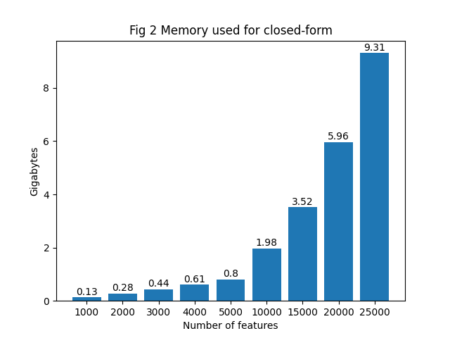

# Introduction
I compared two different optimisation algorithms for linear regression. 
- **Closed-form solution**: An algorithm that provides us instantly with the best-possible weights
- **Gradient descent**: An algorithm that improves weights iteratively

I was interested in how they performed against each other and when one might be more feasible then the other.

# Background
Gradient descent is the dominant optimisation algorithm in practice. The closed-form algorithm is an alternative, which textbooks tell us doesn't scale well and isn't available for non-linear problems such as logistic regression and neural networks. I have added technical details on these issues, such as derivation of gradients, [here](./linear_regression.pdf). One point, for example, is that the closed-form algorithm requires O(D**2) space with D being the number of features, whereas gradient descent only needs O(D), meaning the latter scales better. One reason we would want to use closed-form is because it gives us for sure the best weights, whereas theoretically we could stop gradient descent too soon and end up with suboptimal weights.

# Data
I used the California Housing dataset,  which contains about 20k samples to predict house prices based on 8 variables such as median income. More details can be found [here](https://scikit-learn.org/stable/datasets/real_world.html#california-housing-dataset). I extended the original dataset to create 25,000 random, synthetic features using the np.random functionality.

# TL;DR
A rule of thumb is that the closed-form algorithm can be comfortably used with most datasets up to 10,000 features.

# Lessons
1. The closed-form algorithm consistently achieves better validation losses on  actual data, and it may take gradient descent probably 500-1000 epochs to essentially get the same result. When we use the original eight variables in the housing dataset, the validation loss for closed-form is 0.25. For gradient descent with 100, 250, and 500 epochs, the losses are 1.11, 0.43, and 0.32 respectively. An additional point about the closed-form solution is that it becomes numerically unstable with large number of features, especially given the random, synthetic data I used, and it would require handling. See Fig 3 in the ./img folder.

2. Closed-form takes more time than gradient descent. Closed-form needs three minutes with 20,000 features but needs seven with 25,000. Gradient descent, however, only requires one minute. I am using a Macbook Pro with 16GB of memory (unclear to me how Apple allocates VRAM given this memory). At 40,000 features the closed-form solution takes more than an hour, and I killed it before completion. 


3. Closed-form uses a lot more more memory than gradient descent, and its memory consumption can grow disproportionately. For example, going from 15,000 to 25,000 features almost triples memory requirements from roughly three to nine gigabytes, and this is for storing weight calculations alone. Note: I do suspect I did not use tracemalloc right, so measurements of memory are likely flawed. What also stands out is that they don't follow the theoretical expectation, probably due to  my use of tracemalloc and the NumPy implementation itself (e.g. it has faster algorithms for intensive computations like matrix inversion). Yet although the numbers are not precisely right, they are directional correct: sometimes we have to work with broken tools. Note that when using 50,000 features plus the bias term, the programme crashes. Gradient descent, however, is still feasible with that many features.



# Meta-lessons
1. **Data is hard**. The closed-form algorithm is supposed to break down, for example, when there are too many features in the dataset, but finding such a dataset is hard. Datasets aren't that well-annotated often, and many contain few features. So I worked with suboptimal data, and augmented it with randomly initiated, synthetic features. A better dataset would have probably been in the language domain or genetic data. Finding semi-suitable took much longer than I thought.   

2. **Formulas  oversimplify**. Textbooks will tell you what the formula for the forward pass might be, and you feel clever when you implement it. What makes you feel dumb, on the other hand is, when your losses look weird and you spend hours and hours looking at weights and their updates. I learned that one solution to my problems was data normalisation. Textbooks rarely tell you that correct implementation of a formula does not equal a functioning algorithm. A successful ML programme requires a lot more engineering tricks, archaeology, and paranoia than I thought. I guess my expectations got a weight update!

3. **Believe the smoking gun**. I think a lot of engineering success is about psychology. For example, we want our algorithms to work, so there is confirmation bias. I noticed initially that my algorithm seemed to work in many places, but there was some weird behaviour elsewhere, e.g. gradient descent losses exploded after one epoch but massively dropped in the second epoch (hint: overflow and discrepant measurement scales of variables). I had to force myself to look into those, because it was so seductive to take the chips that were already on the table.

# Repository structure
```
├── requirements.txt        # Libraries for installation 
├── comparison.py           # Main experiment runner
├── utils.py                # Algorithm implementations
├── linear_regression.pdf   # Mathematical derivations
├── test_funcs.py           # Unit tests
├── imgs/                   # Generated plots
└── README.md
```

