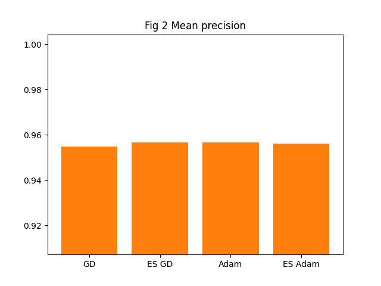
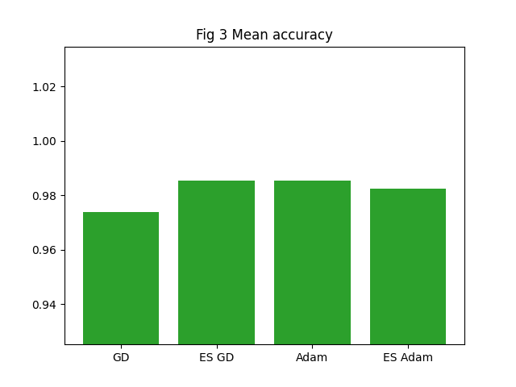

# Introduction
Here, I built logistic regression from scratch for binary classification. This implementation focused on achieving two things:
- **Numerically stable vectorisation**
- **L1 regularisation**

I then compared four variants of this base implementation. The variants used different optimisation strategies: 
- **Gradient descent with a static 50 epochs of training**
- **Adam with a static 50 epochs of training**
- **Gradient descent with early stopping**
- **Adam with with early stopping**

The 50 static epochs were randomly chosen. The early stopping variants used a validation set and exited training once the model stopped improving significantly. I used five random seeds and then evaluated average performance on loss, precision, and accuracy using the test set. Finally, I compared my logistic regression variants against bench marks. 

# TL;DR
My implementation is competitive with benchmarks, even achieving a tiny higher accuracy. Adam with early stopping is an efficient optimiser that makes training feasible.

# Data
I used the 1992 [Breast Cancer Wisconsin](https://archive.ics.uci.edu/dataset/15/breast+cancer+wisconsin+original) dataset. The data was surprisingly well-annotated. See the data folder. The task of the logistic regression, therefore, was to classify biopsy samples for potential breast cancer as benign or malevolent. 

# Sources
I used Grosse's lecture [notes](https://www.cs.toronto.edu/~mren/teach/csc411_19s/lec/lec08_notes.pdf) to implement the general logistic regression framework. I used the original [Kingma and Ba (2017)](https://arxiv.org/abs/1412.6980) paper to implement Adam. I also used the [Prechelt paper](https://link.springer.com/chapter/10.1007/978-3-642-35289-8_5) for early stopping initially but later adapted it.

# Findings

### All models are better than randomness
Randomly initiated weights achieve a test set loss, precision, and accuracy of 1.68, 0.36, and 0.42 respectively. All logistic regression variants outpeform this. See below.

### Adam converges much quicker 
While gradient descent with early stopping on average takes around 15,000 epochs to converge, Adam with early stopping converges on average within 30 epochs. On computationally intensive problems, Adam would be the only choice.

### The variants perform similarly on metrics
I think the metrics that really matter here are precision and accuracy. All variants do equally well on precision.



Re accuracy, a textbook might tell us that 50 epochs of gradient descent underfit the data. Another way of looking at it, however, is that after 50 epochs you get most of your bang for your buck, and several thousands of epochs won't make your model much better - aka extremely diminishing returns.



### The logistic variants are competitive
My variants achieve about 0.95 on precision and 0.98 on accuracy. This is in line with the benchmarks published on [the official repository](https://archive.ics.uci.edu/dataset/15/breast+cancer+wisconsin+original) for the data: various models such as logistic regression, random forests, or neural networks also achieve results between 0.95 and 0.955 for precision and 0.96 and 0.965 for accuracy. In fact, my accuracy is slightly higher. However, resisting the temptation to feel smug, I would simply ignore this and settle for the variants being generally competitive. (Even if not a fluke, does a one-basis-point improvement really matter?)

# Notable bug: negative losses
I do think that the real lessons are in the bugs that we encounter along the way. Yes, I faced a bunch of dumb and not so dumb bugs - from messing up stopping conditions to the inability to figure out differential results when they should be the same (hint: check your hyperparameters). However, the most important bug I encountered was around the loss function.

When I ran my fifth random seed, the programme gave me an overflow warning. As I tried to trace the error, I started to think more about losses themselves. In my earlier version of the programme, my losses became negative after several epochs of training. Although I initially accepted this without question, and even felt good watching losses become increasingly negative, eventually I become suspicious. I realised that losses couldn't possibly be less than 0 if all the inputs to the loss function were correct, i.e. y labels were 0 and 1, and that in fact was the problem: the inputs weren't right. The labels were not 0 and 1. Instead, the researchers who had created the dataset had coded benign y samples as 2 and malignant y samples as 4. And although this was mentioned in the data repository, by the time I coded, I had forgotten all about it. So the incorrect y labels drove the losses into negative numbers (and then also created an overflow problem in one of the seeds).

I corrected the labels. But the experience made me think more about what losses actually mean in the context of logistic regression. Yes, we often chase the loss metric as a end-all and be-all. But the losses are actually a "surrogate objective": they represent how confident the logistic regression is in the labels it assigns to samples. Yes, in a sense we need the loss as we use it to optimise the weights. But what we really care about is the performance on the actual tasks, and the actual task here are accuracy and precision.

Now, accuracy and precision will quickly get close to optimal (e.g. 50 or less epochs), and after that there is no meaningful improvement. Loss, however, will continue to improve for a long time as the model becomes more and more confident in the labels it attributes.

# Structure of this experiment
```
logistic_regression/
├── data/
│   ├── breast-cancer-wisconsin.data
│   └── breast-cancer-wisconsin.names
├── charts/
├── utils.py                            # Functions that make up programme 
├── charting.py                         # Function for saving bar charts
├── logistic_regression.py              # Main programme
├── logistic_regression.pdf             # Maths, e.g. differentiation of gradients 
├── lr_tests.py                         # Unit tests 
├── README.md
└── requirements.txt                    # Libraries needed for running programme
```
